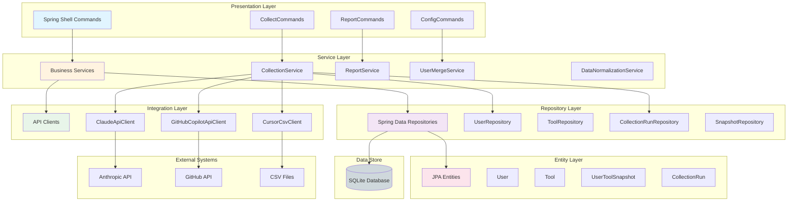

# ADR-003: Arquitetura em Camadas (Layered Architecture)

**Status:** Accepted
**Date:** 2026-01-22
**Deciders:** @Architect, @Dev

## Context

O sistema AI User Control é uma aplicação CLI complexa que interage com múltiplas APIs externas, processa dados, persiste informações e gera relatórios. Precisamos de uma arquitetura clara que separe responsabilidades, facilite testes e manutenção.

### Requisitos Arquiteturais
- Separação clara de responsabilidades
- Testabilidade (unitária e integração)
- Baixo acoplamento entre componentes
- Alta coesão dentro das camadas
- Facilidade de manutenção e evolução
- Código limpo e organizado

## Decision

**Adotamos arquitetura em camadas (Layered Architecture) com 6 camadas principais:**

1. **Presentation Layer** (CLI Commands)
2. **Service Layer** (Business Logic)
3. **Repository Layer** (Data Access)
4. **Integration Layer** (External APIs)
5. **Entity Layer** (Domain Models)
6. **Configuration Layer** (Spring Configuration)

## Architectural Diagram



## Layer Responsibilities

### 1. Presentation Layer (Commands)

**Responsabilidade:** Interação com usuário via CLI

**Componentes:**
- `@ShellComponent` classes
- Parsing de parâmetros
- Validação de entrada
- Formatação de output
- Progress indicators

**Exemplo:**
```java
@ShellComponent
@ShellCommandGroup("Data Collection")
public class CollectCommands {

    private final CollectionService collectionService;

    @ShellMethod(value = "Collect data from all AI tools", key = "collect")
    public String collect(
        @ShellOption(defaultValue = "false") boolean silent,
        @ShellOption(defaultValue = "false") boolean verbose
    ) {
        CollectionResult result = collectionService.collectAll(silent, verbose, "");
        return formatResult(result);
    }
}
```

**Regras:**
- ❌ Não contém lógica de negócio
- ❌ Não acessa repositories diretamente
- ❌ Não chama APIs externas
- ✅ Apenas orquestra chamadas aos services
- ✅ Valida entrada do usuário
- ✅ Formata saída

### 2. Service Layer (Business Logic)

**Responsabilidade:** Lógica de negócio e orquestração

**Componentes:**
- `@Service` classes
- Transações (`@Transactional`)
- Validações de negócio
- Orquestração de múltiplos repositories
- Cálculos e transformações

**Exemplo:**
```java
@Service
public class CollectionService {

    private final List<ToolApiClient> apiClients;
    private final UserRepository userRepository;
    private final CollectionRunRepository runRepository;
    private final UserMergeService mergeService;

    @Transactional
    public CollectionResult collectAll(boolean silent, boolean verbose, String filter) {
        CollectionRun run = createCollectionRun();

        for (ToolApiClient client : apiClients) {
            if (shouldCollect(client, filter)) {
                try {
                    List<UserData> users = client.fetchUsers();
                    processUsers(users, client.getToolName(), run);
                } catch (ApiClientException e) {
                    handleFailure(client, e, run);
                }
            }
        }

        finalizeRun(run);
        return buildResult(run);
    }
}
```

**Regras:**
- ✅ Contém toda lógica de negócio
- ✅ Gerencia transações
- ✅ Orquestra chamadas a repositories e API clients
- ✅ Aplica regras de negócio (RN-001 a RN-008)
- ❌ Não acessa banco diretamente (usa repositories)
- ❌ Não conhece detalhes de apresentação (CLI)

### 3. Repository Layer (Data Access)

**Responsabilidade:** Acesso e persistência de dados

**Componentes:**
- `@Repository` interfaces (Spring Data)
- Queries customizadas
- Abstrações sobre o banco

**Exemplo:**
```java
@Repository
public interface UserRepository extends JpaRepository<User, Long> {

    Optional<User> findByEmailIgnoreCase(String email);

    List<User> findByIsActiveTrue();

    @Query("SELECT u FROM User u WHERE u.lastSeenAt >= :since")
    List<User> findActiveUsersSince(@Param("since") LocalDateTime since);
}
```

**Regras:**
- ✅ Abstrações sobre persistência
- ✅ Queries otimizadas
- ✅ Usa Spring Data JPA
- ❌ Não contém lógica de negócio
- ❌ Não conhece detalhes de apresentação

### 4. Integration Layer (External APIs)

**Responsabilidade:** Integração com sistemas externos

**Componentes:**
- API clients (`ToolApiClient` implementations)
- DTOs externos
- Tratamento de erros de rede
- Retry e backoff

**Exemplo:**
```java
@Component
@ConditionalOnProperty(prefix = "ai-control.api.claude", name = "enabled")
public class ClaudeApiClient implements ToolApiClient {

    private final WebClient webClient;
    private final ClaudeApiProperties properties;

    @Override
    public List<UserData> fetchUsers() throws ApiClientException {
        return webClient.get()
            .uri("/v1/organizations/{orgId}/members", properties.getOrganizationId())
            .retrieve()
            .bodyToMono(ClaudeMembersResponse.class)
            .retryWhen(Retry.backoff(3, Duration.ofSeconds(1)))
            .block();
    }
}
```

**Regras:**
- ✅ Isola integrações externas
- ✅ Trata erros de rede
- ✅ Implementa retry logic
- ✅ Converte DTOs externos para DTOs internos
- ❌ Não contém lógica de negócio
- ❌ Não persiste dados (retorna para service)

### 5. Entity Layer (Domain Models)

**Responsabilidade:** Modelo de domínio e entidades JPA

**Componentes:**
- Entidades JPA (`@Entity`)
- Value Objects
- DTOs internos

**Exemplo:**
```java
@Entity
@Table(name = "users")
public class User {

    @Id
    @GeneratedValue(strategy = GenerationType.IDENTITY)
    private Long id;

    @Column(unique = true, nullable = false)
    private String email;

    private String primaryName;
    private LocalDateTime lastSeenAt;
    private Boolean isActive;

    // Getters e Setters explícitos (sem Lombok)
}
```

**Regras:**
- ✅ Apenas modelo de dados
- ✅ Validações com Bean Validation
- ✅ Relacionamentos JPA
- ❌ Sem lógica de negócio complexa
- ❌ Getters/setters explícitos (sem Lombok)

### 6. Configuration Layer

**Responsabilidade:** Configuração Spring Boot

**Componentes:**
- `@Configuration` classes
- `@ConfigurationProperties`
- Bean definitions

**Exemplo:**
```java
@Configuration
@ConfigurationProperties(prefix = "ai-control")
@Validated
public class AiControlProperties {
    @NotNull
    private ApiConfig api;

    // Getters e Setters
}
```

## Consequences

### Positive
- ✅ **Separação de Responsabilidades:** Cada camada tem papel bem definido
- ✅ **Testabilidade:** Cada camada pode ser testada isoladamente
- ✅ **Manutenibilidade:** Mudanças localizadas em camadas específicas
- ✅ **Baixo Acoplamento:** Dependências unidirecionais (top-down)
- ✅ **Reusabilidade:** Services podem ser usados por múltiplos commands
- ✅ **Organização:** Estrutura clara e previsível
- ✅ **Padrão Conhecido:** Arquitetura amplamente entendida

### Negative
- ⚠️ **Boilerplate:** Mais classes e interfaces
- ⚠️ **Over-engineering:** Pode ser excessivo para funcionalidades muito simples
- ⚠️ **Performance:** Múltiplas camadas podem adicionar overhead

## Communication Rules

### Dependency Direction (Top-Down)
```
CLI → Service → Repository → Database
     ↓
     API Client → External API
```

**Regras:**
- Camadas superiores dependem de inferiores
- Camadas inferiores **NÃO** conhecem superiores
- Comunicação via interfaces quando possível

### Cross-Cutting Concerns

**Logging:** Todas as camadas (SLF4J)
**Transaction Management:** Service layer (`@Transactional`)
**Exception Handling:** Cada camada trata seus erros específicos
**Configuration:** Injetada via Spring

## Package Structure

```
com.bemobi.aicontrol/
├── command/                    # Presentation Layer
│   ├── CollectCommands.java
│   ├── ReportCommands.java
│   └── ConfigCommands.java
│
├── service/                    # Service Layer
│   ├── CollectionService.java
│   ├── ReportService.java
│   ├── UserMergeService.java
│   └── DataNormalizationService.java
│
├── repository/                 # Repository Layer
│   ├── UserRepository.java
│   ├── ToolRepository.java
│   └── CollectionRunRepository.java
│
├── client/                     # Integration Layer
│   ├── ToolApiClient.java      # Interface
│   ├── ClaudeApiClient.java
│   ├── GitHubCopilotApiClient.java
│   └── CursorCsvClient.java
│
├── entity/                     # Entity Layer
│   ├── User.java
│   ├── Tool.java
│   └── UserToolSnapshot.java
│
├── dto/                        # DTOs
│   ├── UserData.java
│   ├── CollectionResult.java
│   └── claude/
│       └── ClaudeMembersResponse.java
│
├── config/                     # Configuration Layer
│   ├── AiControlProperties.java
│   ├── ClaudeApiProperties.java
│   └── WebClientConfig.java
│
├── exception/                  # Exceptions
│   ├── ApiClientException.java
│   └── ValidationException.java
│
└── util/                       # Utilities
    ├── EmailValidator.java
    └── DateUtils.java
```

## Testing Strategy

### Unit Tests
- **Service Layer:** Mock repositories e API clients
- **API Clients:** Mock WebClient responses
- **Repositories:** Use Spring Data JPA test slice

### Integration Tests
- **Service + Repository:** Test with real database (H2 or SQLite)
- **API Clients:** Use WireMock for API mocking
- **Commands:** Test with Spring Shell test support

### Example:
```java
@ExtendWith(MockitoExtension.class)
class CollectionServiceTest {

    @Mock
    private UserRepository userRepository;

    @Mock
    private ClaudeApiClient claudeClient;

    @InjectMocks
    private CollectionService service;

    @Test
    void testCollectAll_Success() {
        // Test service logic in isolation
    }
}
```

## Related ADRs
- ADR-001: Escolha do Spring Boot (habilita arquitetura em camadas)
- ADR-002: Escolha do SQLite (Repository layer)
- ADR-004: Padrão de Integração com APIs (Integration layer)

## References
- Clean Architecture: https://blog.cleancoder.com/uncle-bob/2012/08/13/the-clean-architecture.html
- Spring Boot Layered Architecture: https://spring.io/guides/gs/serving-web-content/
- Requisitos.md - RF-001 a RF-007

---

> *Generated by Claude Code - @Architect*
