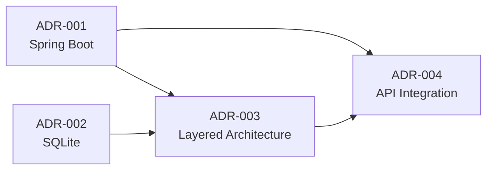

# Architecture Decision Records (ADRs)

Este diretório contém as decisões arquiteturais importantes do projeto AI User Control, documentadas no formato ADR (Architecture Decision Record).

## Índice de ADRs

### Core Architecture

| ADR | Título | Status | Data |
|-----|--------|--------|------|
| [ADR-001](ADR-001-framework-spring-boot.md) | Escolha do Spring Boot como Framework Base | ✅ Accepted | 2026-01-22 |
| [ADR-002](ADR-002-database-sqlite.md) | Escolha do SQLite como Banco de Dados | ✅ Accepted | 2026-01-22 |
| [ADR-003](ADR-003-layered-architecture.md) | Arquitetura em Camadas (Layered Architecture) | ✅ Accepted | 2026-01-22 |
| [ADR-004](ADR-004-api-integration-pattern.md) | Padrão de Integração com APIs Externas | ✅ Accepted | 2026-01-22 |

## Mapa de Dependências



## Visão Geral das Decisões

### Stack Tecnológica

**Framework:** Spring Boot 3.2.x
**Linguagem:** Java 17 LTS
**Banco de Dados:** SQLite
**Build Tool:** Maven
**CLI Framework:** Spring Shell
**HTTP Client:** Spring WebClient

### Padrões Arquiteturais

**Arquitetura:** Layered Architecture (6 camadas)
- Presentation (CLI Commands)
- Service (Business Logic)
- Repository (Data Access)
- Integration (External APIs)
- Entity (Domain Models)
- Configuration (Spring Config)

**Integração APIs:** Strategy Pattern
- Interface comum: `ToolApiClient`
- Implementações específicas por ferramenta
- Retry com exponential backoff
- Conditional bean loading

### Princípios de Design

- ✅ **Separation of Concerns:** Cada camada tem responsabilidade única
- ✅ **Dependency Inversion:** Dependências via interfaces
- ✅ **Single Responsibility:** Classes focadas e coesas
- ✅ **Open/Closed:** Extensível sem modificar código existente
- ✅ **Testability:** Todas as camadas testáveis isoladamente

## Como Usar Este Diretório

### Lendo ADRs

Cada ADR segue a estrutura:
1. **Context:** Problema/decisão que precisa ser feita
2. **Decision:** Solução escolhida
3. **Consequences:** Impactos positivos e negativos
4. **Alternatives Considered:** Opções rejeitadas e motivos
5. **Implementation Notes:** Detalhes técnicos e exemplos

### Propondo Novos ADRs

1. Criar issue no GitHub com label `architecture`
2. Discutir com equipe (@Architect, @Dev, @DevOps, @Product)
3. Criar ADR seguindo template
4. Numerar sequencialmente (ADR-005, ADR-006, etc)
5. Atualizar este README com novo ADR

### Template de ADR

```markdown
# ADR-XXX: [Título]

**Status:** [Proposed | Accepted | Deprecated | Superseded]
**Date:** YYYY-MM-DD
**Deciders:** @Architect, @Dev, @DevOps, @Product

## Context
[Descrever o problema/decisão]

## Decision
[Descrever a solução escolhida]

## Consequences

### Positive
- [Benefício 1]

### Negative
- [Trade-off 1]

## Alternatives Considered
1. **Opção 1:** [descrição] - Rejeitado porque [motivo]

## Implementation Notes
[Detalhes técnicos, diagramas, exemplos]

## Related ADRs
- ADR-XXX: [título]

---
> *Generated by Claude Code - @Architect*
```

## Status dos ADRs

- **Proposed:** Decisão proposta, aguardando discussão
- **Accepted:** Decisão aceita e em uso
- **Deprecated:** Decisão obsoleta mas mantida para histórico
- **Superseded:** Substituída por outro ADR

## Atualizações

### 2026-01-22
- ✅ Criados ADRs 001 a 004 (decisões core)
- ✅ Estabelecida arquitetura base do projeto
- ✅ Definidas tecnologias principais

## Referências

- [Architecture Decision Records (ADR)](https://adr.github.io/)
- [Documenting Architecture Decisions](https://cognitect.com/blog/2011/11/15/documenting-architecture-decisions)
- [ADR Tools](https://github.com/npryce/adr-tools)

---

> *Mantido por: @Architect*
> *Última atualização: 2026-01-22*
